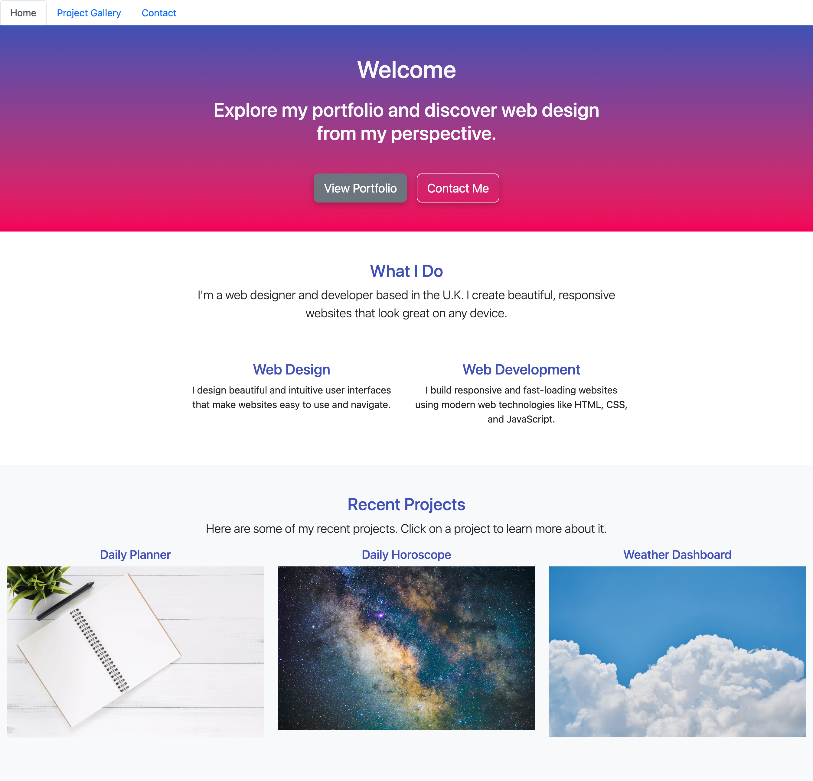

# React-Portfolio

For this challenge, I will utilize what I have learned in `Module 13: React` to develop the initial scaffolding of my portfolio sites.

Now that I've worked with React and have multiple projects to share, it's time to develop the initial scaffolding for my first portfolio site as well as create and/or update other materials so that I can showcase my skills to potential employers. Creating a portfolio using React will help set me apart from other developers whose portfolios do not use some of the latest technologies.

### Design

* Mobile-first design

#### GitHub URL

https://tamarajoniec.github.io/React-Portfolio/
