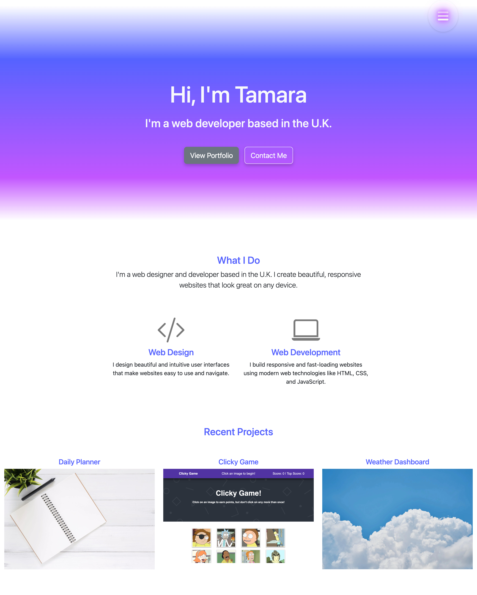

# Portfolio

## Tech Stack

This portfolio is built using the following technologies:

- **React**: A JavaScript library for building user interfaces.
- **CSS**: For styling components.
- **Netlify**: For hosting the website and continuous deployment from GitHub.
- **GitHub**: For version control and source code management.



#### GitHub URL

https://tamarajoniec-portfolio.netlify.app/

## Running Locally

To run this project locally, follow these steps:

1. Clone the repository to your local machine.

2. Navigate to the directory where you cloned the repository:

   ```bash
   `cd path/to/repository`

3. Install the necessary dependencies:

4. Start the development server:

`npm start`

This will launch the project in your default web browser. By default, it will be available at http://localhost:3000.

## Deploying to Netlify

To deploy this project to Netlify, follow these steps:

1. Build your project to create a production version:

`npm run build`

2. Install the Netlify CLI if you haven't already:

`npm install netlify-cli -g`

3. Deploy your site:

`npm run deploy`